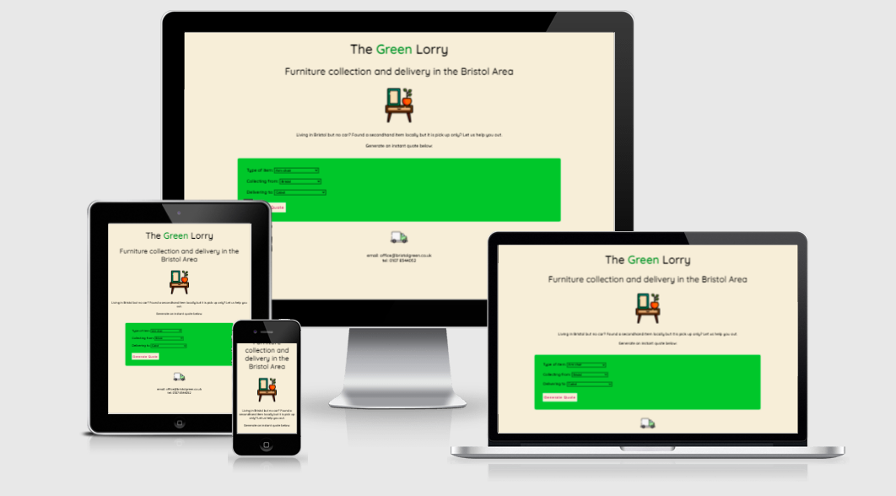
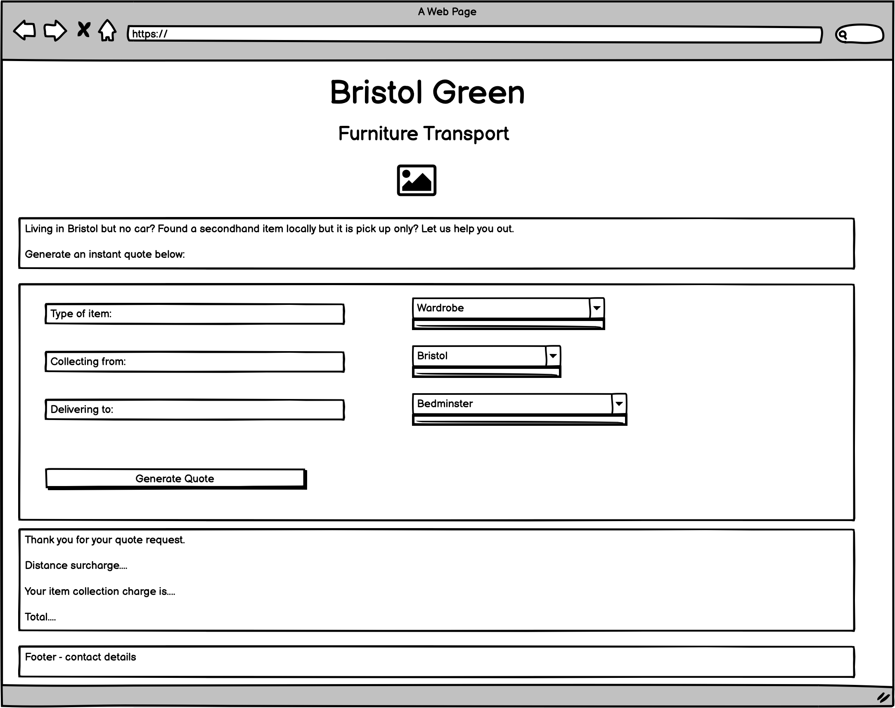
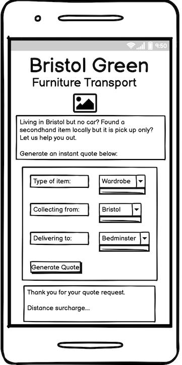
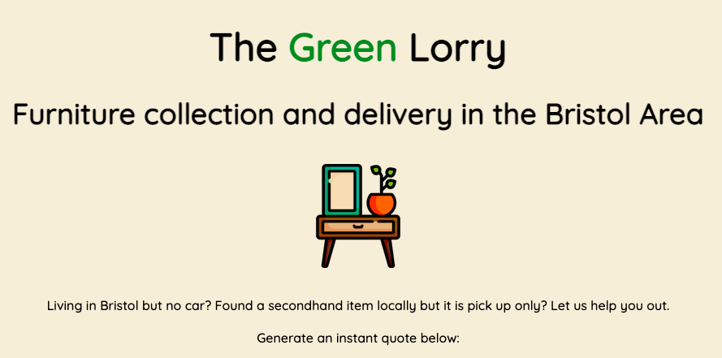
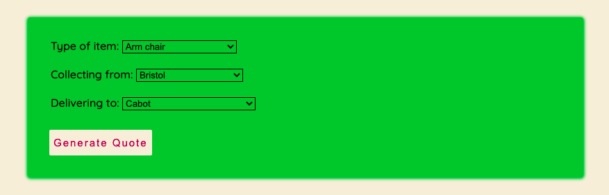
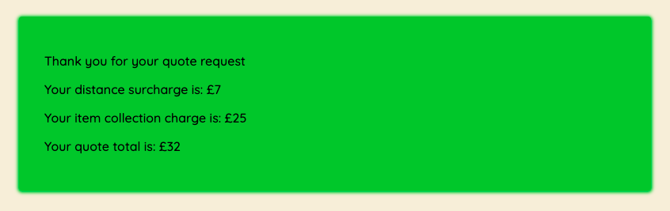
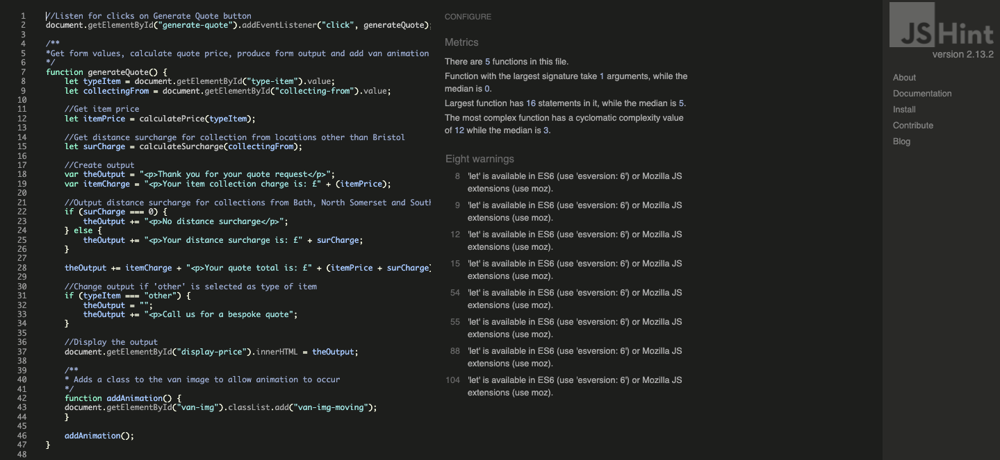
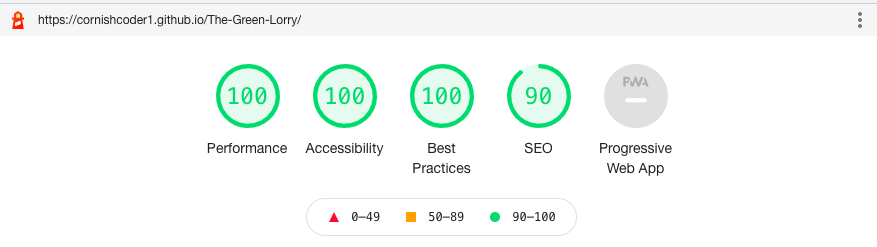

# Bristol Green Furniture Transport

This quote generator is designed to give prices for a fictional furniture transport service based in Bristol. It consists of a simple form with select and option elements, and a 'Generate Quote' button. The key goal of this project is to allow users to generate an instant quote for furniture collection and delivery. The quote output depends on what item is being collected/delivered, and where it is being collected from. Javascript functionality changes the output depending on which options are selected by the user in the form. Clicking the 'Generate Quote' button triggers the output, as well as animating the van icon in the footer section.

<a href="https://cornishcoder1.github.io/The-Green-Lorry/" target="_blank" rel="noopener" aria-label="Link to open deployed site">Link to deployed site</a>

------

## User Stories

The target audience for this project is young professionals in the Bristol area, who are looking for a furniture collection and delivery service. 

As a user I am:
- A young professional living in the Bristol area, who has purchased second hand furniture through an online platform such as Gumtree or Facebook Marketplace.
- A young professional living in the Bristol area, without my own car or adequate transport to pick up larger items.
- Looking for a service which can provide a solution to my collection and delivery requirements. 
- Looking for a quote with a price breakdown, and total cost. 
- Looking for an easy to use quote generator, which gives a clear and accurate price based on my item and collection location. 
 
## UX

I have attempted to incorporate a relevant color scheme, using green and brown which are in keeping with the furniture theme. The page itself is simple and functional, with it's intended purpose being presented clearly from the outset. The user can generate more than one quote by changing the form options and clicking the 'Generate Quote' button to update the output.  

The color scheme consists of #F6EDD9 applied to the background, which is a pale beige color to give adequate contrast with the black heading and introductory text. I have applied #2ABB2A to the form and output divs as a bold but in keeping contrast to the lighter background color of the main page. I chose the background color from a <a href="https://mycolor.space/?hex=%232ABB2A&sub=1">ColorSpace</a> palette generated with #2ABB2A as the primary color. I wanted the design of the site to look simple and clean, with a modern minimal aesthetic. The animation of the van image in the footer adds a nice visual feature after a quote is generated.  

Wireframe for desktop site:

Wireframe for mobile:

------

## Features 

**Heading and Introduction**

The heading and introductory text clearly explain to the user what the page is, and what service is being quoted for. 

**Quote Form**

This section allows the user to select the type of item they require a price for, and what areas the item is to be collected from and delivered to. If 'other' is selected in the 'type of item' selector then the user is advised to contact The Green Lorry for a bespoke quote. If the item is to be collected from an area outside of Bristol, then a distance surcharge is applied to the quote. No additional charges are applied to any of the specified 'Delivering to' locations, as they are all areas of Bristol (price variables are only applied to type of item and location of collection). Users can generate a new quote by changing the options and re-clicking the 'Generate Quote' button to refresh the quote output.  

**Quote Output Section**

This section returns the generated quote information based on what options the user has selected. It clearly displays a thank you message, distance surcharge (if applicable), item collection charge and most importantly the quote total. 

**Footer**

The footer contains contact information, should the user need further assistance and an animated lorry which moves across the page when the 'Generate Quote' button is clicked.  

## Features left to implement

This quote generator would work best as an element incorporated into a wider website for the fictional business. The generation of the quote could be the first step in a complete system which would also incorporate booking and payment. For the quote generator itself, there is alot of potential for it to be more intuitive. I would like to be able to add to the list of items available for selection, or perhaps use a 'predictive' element where the user begins typing the item and the field autofills with potential options. I would also like to use a postcode API to make collection and delivery options more accurate, as the area options given at the moment are too broad.  

------

## Technologies used

- HTML
- CSS
- Javascript
- Gitpod
- GitHub

## Other resources used

<a href="http://ami.responsivedesign.is/#"> - Am I Responsive</a>

<a href="https://balsamiq.com"> - Balsamiq</a>

<a href="https://developer.chrome.com/docs/devtools"> - Chrome Dev Tools</a>

<a href="https://mycolor.space/?hex=%232ABB2A&sub=1"> - ColorSpace</a>

<a href="https://favicon.io/"> - Favicon.io</a>

<a href="http://www.flaticon.com/"> - Flaticon</a>

<a href="https://fonts.google.com/"> - Google Fonts</a>

<a href="https://www.webfx.com/web-design/hex-to-rgb/"> - Instant HEX to RGB value converter</a>

------

# Validator Testing

## HTML

No errors or warnings were detected.

HTML validator result link:

<a href="https://validator.w3.org/nu/?doc=https%3A%2F%2Fcornishcoder1.github.io%2FThe-Green-Lorry%2F"> index.html</a>

## CSS

No errors or warnings were detected.

CSS validator result link:

<a href="https://jigsaw.w3.org/css-validator/validator?uri=https%3A%2F%2Fcornishcoder1.github.io%2FThe-Green-Lorry%2F&profile=css3svg&usermedium=all&warning=1&vextwarning=&lang=en"> style.css </a>

## Javascript

<a href="https://jshint.com">JSHint</a> returned no errors and one warning relating to Let variables.

 

# Bugs

## Fixed
- I originally used an if/else statement within the calculatePrice function, however the statement would not accept values separated by commas, or with an 'or' operand. My orignal fix for this was to separate out values in the if/else statement, but I then changed this to a switch statement instead. 
- I had an issue with CSS not being pushed to my deployed page, this was because I had declared absolute file paths in HTML. I changed them to relative filepaths, and this fixed the issue.
- I originally animated the van in the footer with JavaScript, however when the 'Generate Quote' button was clicked and the van started to 'drive', it didn't stop and gradually increased the size of the horizonal scroll bar as it went. To fix this I created a CSS class with animation and keyframes, and a corresponding function in JS. The keyframe stops the van from continuing further from the right-hand side of the window. 

## Unfixed

- If the 'Generate Quote' button is clicked multiple times without refreshing the DOM, the van in the footer remains in it's final position at the right-hand side of the window. With better knowledge I would have liked to have been able to reset the van to it's original position and re-run the animation each time the 'Generate Quote' button is clicked. 
- When viewing the page on mobile, the down arrows disappear from the select elements. 

------

# Accessibility Testing

Lighthouse scored the site highly on Performance, Accessibility, Best Practices and SEO.

 

# Manual Testing
The website has been tested using the following browsers:
- Google Chrome
- Microsoft Edge
- Mozilla Firefox
- Safari

Within Chrome and Safari, the following breakpoints were checked:
- Large screen sizes from 1200px and down
- Medium screen sizes from 837px and down 
- Small screen sizes from 652px and down
- Extra small screen sizes from 512px and down

Media query required: 
- Extra small screen sizes from 512px and down

The following emulated devices have been tested in Dev Tools: 
- iPhone 5/SE
- iPhone 6/7/8
- iPhone 6/7/8 Plus
- iPhone X
- iPad
- iPad Pro

## Deployment 

Deployment was done at the start of the project to allow device testing throughout the development process. 

My <a href="https://cornishcoder1.github.io/The-Green-Lorry/" target="_blank" rel="noopener" aria-label="Link to open deployed site">project</a> was deployed via GitHub Pages as follows:

1. Go to https://github.com and login
2. Navigate to the required repository (The-Green-Lorry)
3. Click on the "Settings" button
4. Click on "GitHub Pages"
5. Under "Source", click the dropdown for "Branch" select "master" and then "Save"
6. A message will then appear stating that the website is published at the deployed address, this may take a few seconds.  

------

# Credits 

## Content

I used the following websites for research: 

- <a href="https://www.bristolactivecity.org.uk/np-area-map/" target="_blank" rel="noopener">Bristol Active City Area Map</a> 
- <a href="https://shiply.com" target="_blank" rel="noopener">Shiply.com</a>

 

## Media 

1. Nightstand hero image by <a href="https://www.flaticon.com/authors/freepik" target="_blank" rel="noopener"> Freepik</a> on <a href="https://www.flaticon.com/premium-icon/night-stand_997309?term=furniture&related_id=997360&origin=search"> Flaticon</a> 

2. Delivery van image by <a href="https://www.flaticon.com/authors/freepik" target="_blank" rel="noopener"> Freepik</a> on <a href="https://www.flaticon.com/premium-icon/delivery-van_3124236"> Flaticon</a>

 

## Acknowledgements 

- Dave_Horrocks_5P for his invaluable hours of assistance in helping me understand arrays (a previous PP2 idea), switch statements and CSS animation/keyframes. 
- Eventyret_mentor for spotting my file path bug and helping me fix it. 
- John_McPherson_5P for helping me fix my original if/else statement bug. 
- Jon_5P for his regular chats and positivity. 
- Kera Cudmore_5p & Matthias Kiesel_5p for their Peer Review feedback. 
- Love Maths project for reference and guidance.
- Sebastian Immel (Mentor)
- The book 'JavaScript for Kids' by Chris Minnick and Eva Holland. This is where the idea for the quote generator came from.
 
